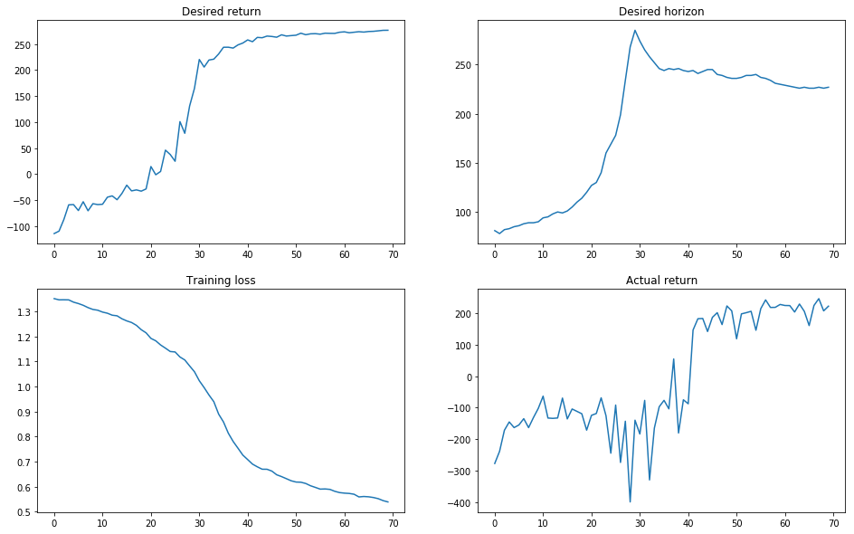
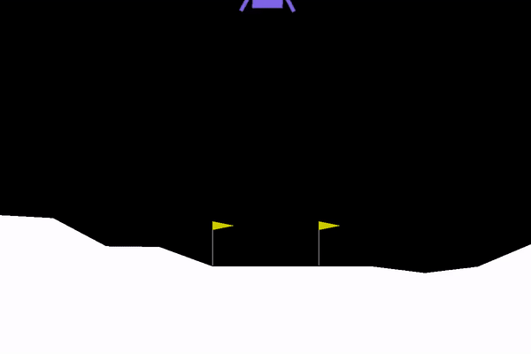

# Upside-Down Reinforcement Learning

Landing a Spaceship using Upside-Down Reinforcement Learning (a.k.a ⅂ꓤ)

This research is based on the paper [Training Agents using Upside-Down Reinforcement Learning](https://arxiv.org/abs/1912.02877) submitted on 5 Dec 2019 by Rupesh Kumar Srivastava, Pranav Shyam, Filipe Mutz, Wojciech Jaśkowski and Jürgen Schmidhuber

See project research and my implementation [here](https://jscriptcoder.github.io/upside-down-rl/Upside-Down_RL.html), solving OpenAI Gym [LunarLander v2](https://gym.openai.com/envs/LunarLander-v2/) environment.

## Abstract

Traditional Reinforcement Learning (RL) algorithms either predict rewards with value functions or maximize them using policy search. We study an alternative: Upside-Down Reinforcement Learning (Upside-Down RL or UDRL), that solves RL problems primarily using supervised learning techniques. Many of its main principles are outlined in a [companion report](https://arxiv.org/abs/1912.02875). Here we present the first concrete implementation of UDRL and demonstrate its feasibility on certain episodic learning problems. Experimental results show that its performance can be surprisingly competitive with, and even exceed that of traditional baseline algorithms developed over decades of research.

## Results

